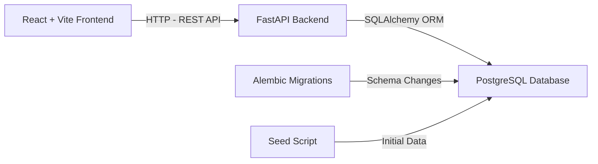
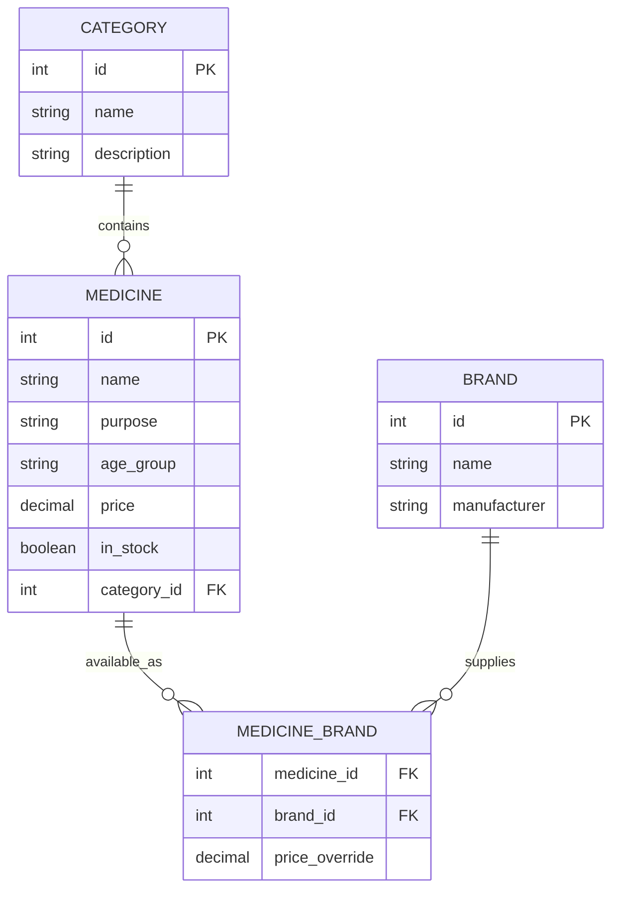

# Pharmacy App — Implementation Plan

## 1. Introduction

**Goal:** Build a simple, intuitive pharmacy application that allows users to browse a catalog of medicines with key details — purpose, availability, price, brands, and age group suitability. The app prioritizes clarity and ease of use, with no authentication barriers.

**Target Audience:** End-users looking up medicine information quickly, and pharmacy staff managing the catalog. The app serves as a reference tool, not a transactional e-commerce platform.

**Scope (Required Features):**
- Medicine list with search and filter capabilities
- Medicine detail view (purpose, availability status, price, brands, age groups)
- Backend API serving medicine data
- Clean, responsive UI

**Out of Scope (Excluded):**
- User authentication / login
- Shopping cart / checkout
- Payment processing
- Prescription uploads

---

## 2. Tech Stack & Role Breakdown

| Layer | Technology | Role |
|-------|-----------|------|
| **Frontend** | React 18 + Vite | Component-based UI with fast dev builds and HMR |
| **HTTP Client** | Axios | API calls to the FastAPI backend |
| **Styling** | Tailwind CSS | Utility-first, responsive design without custom CSS overhead |
| **Backend** | Python 3.12 + FastAPI | RESTful API with auto-generated OpenAPI docs |
| **ORM** | SQLAlchemy 2.0 | Database models, migrations, and query building |
| **Database** | PostgreSQL 16 | Relational storage for medicines, brands, categories |
| **Migration Tool** | Alembic | Version-controlled database schema changes |
| **Seed Data** | Custom Python script | Populate the DB with realistic sample medicines |

---

## 3. High-Level Architecture



The frontend is entirely decoupled from the backend. The React app runs on `localhost:5173` (Vite dev server) and proxies API requests to the FastAPI server on `localhost:8000`. PostgreSQL runs on its default port `5432`.

---

## 4. Database Schema



**Key design decisions:**
- A many-to-many relationship between medicines and brands via the `medicine_brand` join table allows a single medicine (e.g., Paracetamol) to be linked to multiple brands (e.g., Crocin, Dolo), each with an optional price override.
- `age_group` is stored as an enum (`adult`, `child`, `infant`, `all`) for consistent filtering.
- `in_stock` is a boolean flag for immediate availability indication.

---

## 5. Milestones & Deliverables

### Milestone 1 — Project Scaffolding
- Initialize the monorepo with `frontend/` and `backend/` directories
- Scaffold Vite + React project
- Scaffold FastAPI project with a virtual environment
- Set up PostgreSQL database and configure the connection string
- Initialize Alembic and create the first migration
- **Deliverable:** Both servers start and connect successfully

### Milestone 2 — Data Layer
- Define SQLAlchemy models (Category, Medicine, Brand, MedicineBrand)
- Generate and run Alembic migration
- Write the seed script with 30–50 realistic medicines
- Create FastAPI Pydantic schemas for request/response serialization
- **Deliverable:** Database is populated and queryable via the ORM

### Milestone 3 — Backend API
- Implement CRUD endpoints:
  - `GET /api/medicines` — List with search (`?q=`), category filter (`?category=`), age group filter (`?age_group=`), and availability filter (`?in_stock=`)
  - `GET /api/medicines/{id}` — Single medicine with its associated brands
  - `GET /api/categories` — List all categories
  - `GET /api/brands` — List all brands
- Add pagination (`?page=` & `?page_size=`)
- Enable CORS for the Vite dev server origin
- **Deliverable:** All endpoints return correct JSON; OpenAPI docs accessible at `/docs`

### Milestone 4 — Frontend Core UI
- Build the medicine list page with:
  - Search bar (text input that calls the API with `?q=`)
  - Filter chips/sidebar for category and age group
  - Medicine cards showing name, purpose, price, availability badge
  - Pagination controls
- Build the medicine detail page with:
  - Full medicine information
  - List of associated brands with prices
- Implement responsive layout (mobile-first)
- **Deliverable:** Users can browse, search, and filter medicines in the browser

### Milestone 5 — Polish & Handoff
- Add loading skeletons and empty states
- Add error handling for API failures
- Final UI review and spacing/layout adjustments
- Write the project README with setup instructions
- **Deliverable:** Production-ready codebase ready for deployment or further development

---

## 6. Feature Development Steps (Detailed)

### 6.1 Medicine List with Search & Filters

**Backend tasks:**
1. Create the `GET /api/medicines` endpoint in [`backend/app/routers/medicines.py`](backend/app/routers/medicines.py)
2. Build a query builder function that applies optional filters (`q`, `category`, `age_group`, `in_stock`) to a SQLAlchemy query
3. Add pagination logic using `offset` and `limit` calculated from `page` and `page_size` query parameters
4. Return a consistent JSON envelope: `{ "data": [...], "total": int, "page": int, "page_size": int }`

**Frontend tasks:**
1. Create a `useMedicines` custom hook in [`frontend/src/hooks/useMedicines.ts`](frontend/src/hooks/useMedicines.ts) that fetches from the API with debounced search
2. Build `<MedicineCard />` component showing name, purpose snippet, price, and an availability badge
3. Build `<SearchBar />` with a debounced input (300ms) that updates the query parameter
4. Build `<FilterPanel />` with category dropdown and age group radio buttons
5. Wire everything together on the home page, including pagination controls

### 6.2 Medicine Detail View

**Backend tasks:**
1. Create the `GET /api/medicines/{id}` endpoint that eagerly loads associated brands via SQLAlchemy `joinedload`
2. Return the medicine with a nested `brands` array: `[{ "brand_name": "...", "manufacturer": "...", "price": ... }]`

**Frontend tasks:**
1. Create a `<MedicineDetail />` page component that fetches by ID
2. Display all fields: name, purpose, age group, base price, availability
3. Render the brands table with brand name, manufacturer, and individual price
4. Add a back-navigation link to the medicine list

### 6.3 Seed Data Script

Write [`backend/seed.py`](backend/seed.py) to populate the database with realistic Indian pharmacy data. Include common categories (Pain Relief, Antibiotics, Vitamins, Cold & Cough, Diabetes Care) and 30–50 medicines across these categories with 1–3 brands each.

---

## 7. API Endpoint Summary

| Method | Endpoint | Params | Description |
|--------|----------|--------|-------------|
| `GET` | `/api/medicines` | `q`, `category`, `age_group`, `in_stock`, `page`, `page_size` | List medicines |
| `GET` | `/api/medicines/{id}` | — | Single medicine with brands |
| `GET` | `/api/categories` | — | List all categories |
| `GET` | `/api/brands` | — | List all brands |

---

## 8. Project Structure

```
pharmacy-app/
├── frontend/
│   ├── src/
│   │   ├── components/
│   │   │   ├── MedicineCard.tsx
│   │   │   ├── SearchBar.tsx
│   │   │   ├── FilterPanel.tsx
│   │   │   └── Pagination.tsx
│   │   ├── pages/
│   │   │   ├── MedicineList.tsx
│   │   │   └── MedicineDetail.tsx
│   │   ├── hooks/
│   │   │   └── useMedicines.ts
│   │   ├── types/
│   │   │   └── medicine.ts
│   │   ├── App.tsx
│   │   └── main.tsx
│   ├── index.html
│   ├── vite.config.ts
│   └── package.json
├── backend/
│   ├── app/
│   │   ├── models/
│   │   │   ├── medicine.py
│   │   │   ├── category.py
│   │   │   └── brand.py
│   │   ├── schemas/
│   │   │   └── medicine.py
│   │   ├── routers/
│   │   │   ├── medicines.py
│   │   │   ├── categories.py
│   │   │   └── brands.py
│   │   ├── database.py
│   │   └── main.py
│   ├── alembic/
│   ├── seed.py
│   └── requirements.txt
└── README.md
```

---

## 9. Conclusion

This plan outlines a focused, executable path to building the pharmacy application. Each milestone produces a tangible deliverable, and the feature breakdown provides clear tasks for frontend and backend developers to work on in parallel after Milestone 2 is complete.

**Next Steps:**
1. Review and approve this plan
2. Switch to **Code mode** to begin Milestone 1 — Project Scaffolding
3. Execute milestones sequentially, verifying each deliverable before moving on

**Optional Enhancements (post-MVP):**
- Medicine image thumbnails
- Price comparison across brands
- "Recently viewed" medicines via `localStorage`
- Admin panel for adding/editing medicines
